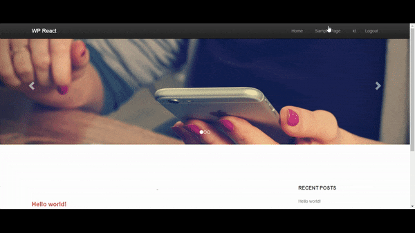

# React JS  + WP Rest API 
> The startup kit to use React JS with Wordpress REST API.


It will provide dynamic menu,any new page created in wordpress will be added in site header.



## Features

* Login
* Signup
* Dynamic Menu
* BlogListing and Single Blog

## Development setup

Clone the project and install node packages:

```
npm i
```
Install webpack and webpack-dev-server globally:

```
npm install -g webpack
npm install -g webpack-dev-server
```

Run the project with
```
webpack-dev-server
```
This will start app on localhost:8080:


Don't forget to Change the URL in Globals.js file with your own wordpress URL.
for example,if domain is mywp.dev
```
this.WP_URL  = 'http://mywp.dev/';
this.WP_API_URL = 'http://mywp.dev/wp-json/';
		
```

## Contributing

1. Fork it (<https://github.com/KhushbuThakkar/wp-react-blog.git>)
2. Create your feature branch (`git checkout -b feature/fooBar`)
3. Commit your changes (`git commit -am 'Add some fooBar'`)
4. Push to the branch (`git push origin feature/fooBar`)
5. Create a new Pull Request

